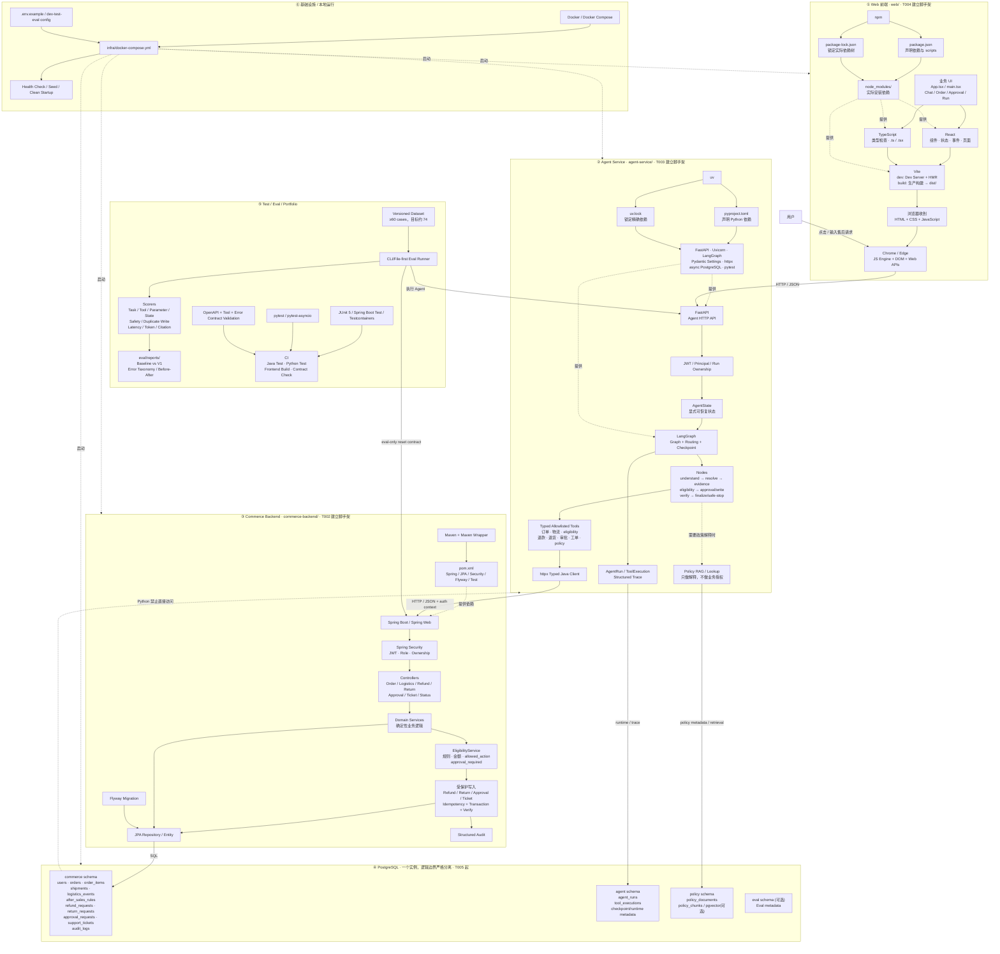

# CommerceAgent 全项目架构与学习地图

> 这份文档把 CommerceAgent 的 **Web、Agent、Java 业务后端、PostgreSQL、Docker、测试/Eval、依赖管理、运行链路和 T001–T083 实现计划** 放在同一张地图里。
>
> 使用方式：以后学习或实现任何新技术时，先找到它属于图中的哪一层，再往对应位置继续细化，不再把 React、Vite、LangGraph、Spring、数据库等当成互相孤立的知识点。
>
> **状态说明**：本文件描述的是已批准设计的目标架构与实现路线。实际完成情况必须以 [`PROJECT_PROGRESS.md`](../PROJECT_PROGRESS.md) 和可复现的代码/Test/Eval 结果为准；没有实测的能力不能写成已实现成果。

---

## 1. 一张图看完整 CommerceAgent



### 最核心的一条执行链

```text
用户
  ↓
React 页面（你写的 TSX）
  ↓
TypeScript 在开发期做类型检查
  ↓
Vite 在开发期提供 Dev Server/HMR，生产期生成 dist/
  ↓
浏览器真正执行 HTML / CSS / JavaScript
  ↓ HTTP/JSON
FastAPI Agent API
  ↓
LangGraph + AgentState
  ↓
根据证据动态决定下一步 Tool
  ↓
httpx 调用类型化 Java API
  ↓
Spring Security / Controller / Service
  ↓
Eligibility + 业务状态机 + 幂等 + 审批 + 事务
  ↓
JPA / PostgreSQL
  ↓
写后查询并验证权威业务状态
  ↓
结果原路返回 Agent
  ↓
Agent 生成基于已验证事实的最终结果
  ↓
React 更新 UI
  ↓
用户看到结果
```

---

## 2. 六层怎么记

| 层 | 主要技术 | 它负责什么 | 不负责什么 |
|---|---|---|---|
| Web/UI | React | 组件、页面、交互、展示 run/结果/trace | 不做退款资格和业务授权 |
| Web 工程 | TypeScript、Vite、npm | 类型检查、开发服务器、构建、前端依赖管理 | 不决定业务状态 |
| Agent | Python、FastAPI、LangGraph、httpx | 理解请求、维护状态、收集证据、选 Tool、恢复流程 | 不覆盖 Java 的 ownership/金额/eligibility/approval |
| Business | Java、Spring Boot、Spring Security、JPA | 权限、业务规则、状态迁移、事务、幂等、安全写入 | 不让 LLM 决定资金授权 |
| Data | PostgreSQL、Flyway、pgvector(可选) | 权威数据、Agent runtime、Policy knowledge、可选 Eval metadata | 一个物理 DB 不代表所有服务共享权限 |
| Infra/Eval | Docker Compose、JUnit、pytest、CI、Eval Runner | 可复现运行、测试、评估、证据 | 不用装饰性基础设施替代真实业务闭环 |

---

## 3. Web：React、TypeScript、Vite、npm、浏览器到底是什么关系

### 3.1 你写的 `App.tsx` 属于哪里

```text
App.tsx / main.tsx / Feature Components
        │
        ├── React：提供组件、状态、事件、渲染模型
        │
        └── TypeScript：给代码增加静态类型检查
                 │
                 ▼
               Vite
        ┌────────┴────────┐
        │                 │
   npm run dev       npm run build
        │                 │
Dev Server + HMR       生产构建
实时转换 TS/TSX        优化并生成 dist/
        │                 │
        └────────┬────────┘
                 ▼
       HTML + CSS + JavaScript
                 ▼
          Chrome / Edge 执行
```

浏览器最终主要执行 **JavaScript**，不是把 TypeScript 类型系统直接当运行时执行。

### 3.2 npm 与前端依赖

```text
package.json
= “项目希望使用什么依赖/脚本”

package-lock.json
= “这次实际解析出的完整依赖树”

node_modules/
= “当前机器实际安装出来的依赖文件”
```

开发时：

```text
修改 package.json
  ↓
npm install
  ↓
允许重新解析依赖
  ↓
package-lock.json 可以自动更新
```

可复现/CI 安装时：

```text
npm ci
  ↓
要求 package.json 与 package-lock.json 一致
  ↓
严格按 lock 安装；不一致则失败
```

### 3.3 T004 做什么

T004 **不是开发 CommerceAgent 业务页面**，而是把 `web/` 从空目录变成一个能开发、能启动、能 build 的 React + TypeScript + Vite 工程。

目标基线：

```text
web/
├── package.json
├── package-lock.json
├── index.html
├── vite.config.*
├── tsconfig*.json
├── public/
└── src/
    ├── main.tsx
    └── App.tsx
```

后续业务 UI 再逐步扩展：

```text
web/src/
├── features/chat/
├── features/approvals/
├── features/runs/
├── features/eval/
└── api/
```

---

## 4. Agent Service：Python、uv、FastAPI、LangGraph

### 4.1 uv 与 Python 依赖

```text
pyproject.toml
= Python 项目与依赖声明

uv.lock
= 精确解析结果，用于复现

uv sync
= 根据 pyproject + lock 同步环境；必要时可更新解析

uv sync --locked
= 不允许 lock 因声明变化而被偷偷改写；不一致就失败
```

T003 的目标是建立 Python 3.13 Agent 项目，并加入：

- FastAPI
- Uvicorn
- LangGraph
- Pydantic Settings
- httpx
- PostgreSQL / async DB 依赖
- pytest
- pytest-asyncio
- `uv.lock`

T003 阶段只做脚手架，不提前实现 `AgentState`、Tool、Graph 或业务流程。

### 4.2 Agent 的核心职责

Agent 不等于“让 LLM 随便决定调用什么”。目标设计是：

```text
用户请求
  ↓
understand_request
  ↓
resolve_order
  ├─ 0 个 → 无法处理/澄清
  ├─ 1 个 → 继续
  └─ 多个 → WAITING_USER
  ↓
decide_next_evidence
  ↓
读取订单 / 物流 / 必要政策
  ↓
validate evidence
  ↓
check deterministic eligibility
  ├─ REFUND_ONLY
  ├─ RETURN / RETURN_REFUND
  ├─ approval_required
  ├─ MANUAL_REVIEW
  └─ DENY
  ↓
受保护写入
  ↓
verify business state
  ↓
finalize / safe stop / escalation
```

关键边界：

- LLM 可以帮助理解自然语言和在受限 capability 中选择下一项证据；
- Java 才是 ownership、eligibility、金额、审批和合法状态迁移的权威；
- 模型不能提供任意 URL、SQL、内部服务名让系统执行；
- Prompt Injection 不能改变 principal、Tool allowlist 或资金授权；
- Trace 保存结构化状态与 Tool 结果，不保存 hidden chain-of-thought。

### 4.3 AgentState 未来要保存什么

- `run_id`
- principal context
- intent
- candidate / resolved order
- collected evidence
- eligibility decision
- approval reference/status
- tool history
- step / retry budget
- write state
- verification state
- terminal status

主要 Run 状态：

```text
RUNNING
WAITING_USER
WAITING_APPROVAL
COMPLETED
ESCALATED
FAILED
SAFE_STOP
```

---

## 5. Java Backend：为什么业务权威放这里

Java Backend 是模块化单体，不拆微服务。

目标模块：

```text
commerce-backend/src/main/java/.../commerceagent/
├── security/
├── order/
├── logistics/
├── eligibility/
├── refund/
├── returns/
├── approval/
├── ticket/
├── audit/
└── fixture/
```

一次写操作必须经过类似链路：

```text
HTTP Request
  ↓
Spring Security
  ↓
从 authenticated principal 确定用户身份
  ↓
Controller
  ↓
Service
  ↓
重新读取权威业务状态
  ↓
校验 ownership
  ↓
校验 eligibility
  ↓
校验 amount
  ↓
如需要：校验权威 approvalRequestId binding
  ↓
校验 idempotency key
  ↓
事务写入
  ↓
Audit
  ↓
返回权威结果
```

Agent 即使说“退款成功”，只要 Java/DB 没有确认，就不能把它当成成功。

---

## 6. PostgreSQL：一个实例，四种语义所有权

### 6.1 `commerce` schema — Java 业务权威

核心实体：

- `User`
- `Order`
- `OrderItem`
- `Shipment`
- `LogisticsEvent`
- `AfterSalesRule`
- `RefundRequest`
- `ReturnRequest`
- `SupportTicket`
- `ApprovalRequest`
- `AuditLog`

核心原则：

- Order ownership 不可由模型指定；
- 价格、状态来自权威持久化数据；
- `EligibilityDecision` 由确定性规则计算；
- Refund/Return 必须幂等；
- Approval 只能由授权 Approver 决策；
- 未知写入结果不能盲重试。

### 6.2 `agent` schema — Python runtime / trace

- `AgentRun`
- `ToolExecution`
- checkpoint / runtime metadata

`AgentRun` 是执行状态，不是业务授权。

### 6.3 `policy` schema — 政策知识

- `PolicyDocument`
- `PolicyChunk`
- 可选 pgvector embedding

Policy/RAG 只用于解释与引用，不能改变：

- Tool allowlist
- auth / principal
- eligibility
- max refund amount
- approval requirement
- 业务状态迁移

### 6.4 `eval` schema — 可选

V1 Eval 以 Git 版本化 dataset + CLI/file report 为主；数据库只在确实需要保存 Eval metadata 时使用。

### 最关键数据库边界

```text
Python Agent ──X──> commerce.* 直接 SQL

Python Agent
    │
    │ typed HTTP API
    ▼
Java Backend
    │
    ▼
commerce.*
```

这条边界最终应该由独立 DB role/permission 强制，而不是只靠“大家记得别访问”。

---

## 7. 六个用户故事最终怎么进入这张图

### US1 — 物流异常退款

```text
用户：“一直没收到，我不要了，退款”
→ 定位订单
→ 查物流
→ eligibility = REFUND_ONLY
→ create_refund_request
→ verify
```

目标：恰好一个逻辑退款，unknown timeout 也不能重复写。

### US2 — 已签收改走退货

```text
同样是“退款”诉求
→ 发现 DELIVERED
→ eligibility = RETURN / RETURN_REFUND
→ create_return_request
```

这是 Agent Value Gate 的核心：**相似语言输入，因为证据不同而改变路径**。

### US3 — 模糊订单澄清

```text
“把上次买的耳机退掉”
→ 多个候选订单
→ WAITING_USER
→ 用户选择
→ resume
```

澄清前写操作必须为 0。

### US4 — 高风险人工审批

```text
eligibility = allowed + approval_required
→ create authoritative ApprovalRequest
→ WAITING_APPROVAL
→ Approver 决策
→ Agent resume 时重新读取并校验 binding
→ 才能继续敏感写入
```

### US5 — 无法安全自动处理时转人工

```text
依赖持续失败 / 状态冲突 / MANUAL_REVIEW / 无新证据
→ 达到 retry/step budget
→ create_support_ticket 或 SAFE_STOP
```

### US6 — 政策检索与解释

```text
需要解释
→ policy_search
→ 返回 document/version/effective date/section
→ 用于解释
→ 最终业务授权仍来自 Java eligibility
```

---

## 8. 写操作为什么必须“幂等 + 写后验证”

最典型问题：网络超时并不等于服务端一定没成功。

正确恢复：

```text
create_refund_request(idempotency=K)
  ↓
timeout / outcome unknown
  ↓
禁止直接换一个 key 再写一次
  ↓
get_after_sales_status
  ├─ 已存在退款 → 返回已有结果
  └─ 权威状态证明没写入 → 才允许 same-key retry
```

最终目标永远是：

```text
一个逻辑请求 = 最多一个逻辑退款/退货对象
```

---

## 9. Test / Eval：项目不是“能跑 Demo 就算完成”

### Java

- JUnit 5
- Spring Boot Test
- Testcontainers
- ownership / authorization
- deterministic eligibility
- amount bound
- illegal state transition
- idempotency reuse/conflict
- approval binding

### Python

- pytest
- pytest-asyncio
- Graph branching
- clarification resume
- HITL
- retry budget
- no-progress detection
- unknown-write recovery
- safe stop / escalation

### Contract

- `commerce-api.openapi.yaml`
- `agent-api.openapi.yaml`
- `tool-contracts.md`
- `error-contracts.md`
- `eval-internal-api.md`

### Offline Eval

Dataset 最低设计目标 ≥60 cases，目标约 74。

至少测量：

- Task Success Rate
- Tool Selection Accuracy
- Parameter Accuracy
- Business-State Correctness
- Policy Compliance Rate
- Unsafe Action Rate
- Duplicate Write Rate
- Average Tool Calls
- p50 / p95 latency
- Token usage / cost
- retrieval/citation metrics（仅相关 case）

Baseline 与 V1 必须使用：

- 同一 dataset version
- 同一 reset state
- 同一 Tool 权限
- 同一指标定义

没有真实 Eval 产物前，目标数字不能写成“已达成”。

---

## 10. Docker / 本地运行最终形态

目标服务：

```text
Docker Compose
├── postgres
├── commerce-backend
├── agent-service
└── web
```

目标启动方式：

```bash
docker compose -f infra/docker-compose.yml up --build
```

启动后至少检查：

- PostgreSQL healthy
- Java Business API healthy
- Agent API healthy
- Web build/start 正常
- 如启用 Policy RAG，政策数据准备完成

---

## 11. 目标目录结构

```text
CommerceAgent/
├── README.md
├── PROJECT_PROGRESS.md
├── AGENTS.md
├── docs/
│   ├── PROJECT_ARCHITECTURE.md   # 本文件
│   └── devlog/
│
├── commerce-backend/
│   ├── pom.xml
│   ├── mvnw
│   ├── mvnw.cmd
│   ├── .mvn/
│   └── src/
│       ├── main/java/.../commerceagent/
│       │   ├── security/
│       │   ├── order/
│       │   ├── logistics/
│       │   ├── eligibility/
│       │   ├── refund/
│       │   ├── returns/
│       │   ├── approval/
│       │   ├── ticket/
│       │   ├── audit/
│       │   └── fixture/
│       └── test/
│
├── agent-service/
│   ├── pyproject.toml
│   ├── uv.lock
│   └── app/
│       ├── main.py
│       ├── api/
│       ├── security/
│       ├── agent/
│       │   ├── graph.py
│       │   ├── state.py
│       │   ├── routing.py
│       │   └── nodes/
│       ├── tools/
│       ├── clients/
│       ├── rag/
│       ├── trace/
│       └── config/
│
├── web/
│   ├── package.json
│   ├── package-lock.json
│   ├── vite.config.*
│   ├── tsconfig*.json
│   └── src/
│       ├── main.tsx
│       ├── App.tsx
│       ├── api/
│       └── features/
│           ├── chat/
│           ├── approvals/
│           ├── runs/
│           └── eval/
│
├── eval/
│   ├── datasets/
│   ├── runner/
│   ├── scorers/
│   ├── baselines/
│   └── reports/
│
├── knowledge/
│   └── policies/
│
├── infra/
│   └── docker-compose.yml
│
└── specs/
    ├── 001-agent-career-project/
    └── 002-commerce-after-sales-agent/
        ├── spec.md
        ├── plan.md
        ├── research.md
        ├── data-model.md
        ├── quickstart.md
        ├── tasks.md
        └── contracts/
```

---

## 12. T001–T083 全项目路线图

> 详细执行内容以 [`tasks.md`](../specs/002-commerce-after-sales-agent/tasks.md) 为准；这里负责把每组 Task 放回总架构中。

| Task | 目标 | 主要落点 |
|---|---|---|
| T001–T007 | Setup：Java/Python/Web/PostgreSQL/配置脚手架 | 全图的基础工程层 |
| T008–T018 | Foundation：Schema、Entity、Auth、Error、Audit、AgentState、Trace、API skeleton | Java + Agent + DB |
| T019–T035 | US1 物流异常退款 MVP | Web → Agent → Java → DB 首个纵向闭环 |
| T036–T042 | US2 已签收改走退货 | Evidence-dependent branching |
| T043–T048 | US3 模糊订单澄清 | WAITING_USER + checkpoint/resume |
| T049–T056 | US4 高风险人工审批 | WAITING_APPROVAL + authoritative approval binding |
| T057–T063 | US5 安全转人工 | retry budget + safe stop + SupportTicket |
| T064–T070 | US6 Policy/RAG（可延期） | policy schema + retrieval + citation |
| T071–T083 | Eval / CI / Docker / Final Portfolio | 可复现证据与最终交付 |

### Setup 细化

```text
T001  创建根目录与最小 README
T002  Spring Initializr → commerce-backend
T003  uv init → agent-service + uv.lock
T004  Vite React TS → web
T005  PostgreSQL + schema ownership + Docker Compose
T006  Java/Python lint / static analysis / test 配置
T007  dev/test/eval settings
```

### Foundation 细化

```text
T008   初始 Flyway schema
T009   Order / Shipment 等 Entity + Repository
T010   AfterSalesRule
T011   JWT + role-aware principal
T012   Error Envelope
T013   Audit Writer
T014   dev/eval fixture + reset
T015   AgentState
T016   typed Java API Client
T017   Agent Run / Checkpoint / Tool Trace
T018   FastAPI auth + run ownership + skeleton endpoints
```

### US1 纵向 MVP

```text
T019–T022  先写 Java/Python 核心测试
T023–T028  Order / Logistics / Eligibility / Refund Java API
T029       Typed Tools
T030–T032  LangGraph nodes + routing + graph
T031       特别实现 unknown-write recovery
T033       Agent Run API
T034       最小 Customer Console
T035       US1 Eval cases
```

**强制 Gate**：

```text
Web/API
  → Agent
  → Java Tool
  → PostgreSQL
  → exactly one RefundRequest
  → verified result
  → structured trace
```

未通过前不扩展 MCP、Multi-Agent、装饰性 Dashboard。

### US2–US6

```text
T036–T042  Delivered → Return
T043–T048  Clarification / WAITING_USER
T049–T056  Approval / WAITING_APPROVAL
T057–T063  Safe Stop / Escalation
T064–T070  Policy Retrieval / Citation
```

### 最终交付

```text
T071  Eval Runner
T072  Scorers
T073  Fixed-workflow Baseline
T074  冻结 ≥60 cases dataset
T075  Baseline vs V1
T076  一次可归因优化
T077  Dashboard OPTIONAL
T078  Contract Validation
T079  Adversarial E2E
T080  CI
T081  Docker clean startup + Dockerfile
T082  跑完整 quickstart 验收
T083  最终作品集 README
```

---

## 13. 当前阶段怎么映射到总图

实际当前 Task 必须以 `PROJECT_PROGRESS.md` 为准，不在本架构文档硬编码长期不变的“当前任务”。

截至 T016 前后的 Foundation 阶段，可以这样定位：

```text
① Web
   目前主要还是脚手架

② Agent 接入层
   T018 将补 FastAPI Auth / Run API

③ Agent 大脑层
   T015 AgentState ✅
   T030–T032 才进入理解 / 路由 / LangGraph 核心

④ Tool / Client 层
   T016 CommerceClient ← 当前附近
   T029 Typed Tools     ← 后续第一次明显有 Tool Calling 感

⑤ Java 业务权威层
   T009–T014 已完成大量基础
   T023–T028 会补 US1 真正业务 API

⑥ PostgreSQL
   T005/T008 已建立基础边界
```

Foundation 后半段已经不是单纯环境搭建。T015–T018 正在建立 **Agent runtime 与真实业务系统之间的运行边界**。

学习时不要只看 `T016 / 83`，而应同时看：

```text
工程骨架             已建立
业务权威基础         已建立主要部分
Agent Runtime        正在建立
Agent 决策 / Routing 尚未开始
Tool Execution       尚未开始
HITL / Resume        尚未开始
Eval                 仅有基础 fixture，完整评估未开始
```

具体教学方式见 `docs/LEARNING_PROTOCOL.md`。

---

## 14. 项目真正要证明的能力

CommerceAgent 不是为了堆技术名词，而是要用可复现证据证明下面这些事情：

1. **自然语言理解不是最终授权**：LLM 可以理解请求，但 Java 决定能不能做。
2. **证据能改变路径**：SHIPPED、DELIVERED、AMBIGUOUS、高金额等状态必须走出不同后续动作。
3. **资金/状态写入安全**：ownership、eligibility、amount、approval、idempotency、transaction 都在后端重校验。
4. **故障不会导致重复写**：unknown timeout 必须查权威状态后恢复。
5. **Human-in-the-loop 是权威流程**：Agent 不能 self-approve。
6. **RAG 不是业务数据库**：政策文本只能解释，不能授权退款。
7. **失败也可审计**：只靠 Structured Trace 就能重建关键执行路径，不依赖隐藏思维链。
8. **效果可测**：使用冻结 Dataset、Baseline、Scorer 和真实报告，而不是主观 Demo。

---

## 15. 明确不做 / 不让它污染 MVP

除非未来出现新的可测需求，否则核心项目不加入：

- Multi-Agent
- Kafka
- Kubernetes
- Redis-as-core
- 独立 Vector DB
- 真实支付网关
- 真实淘宝/JD/ERP 集成
- 大而全 Admin CRUD
- 通用全渠道客服
- 售前推荐 / 营销 / 采购
- Model Fine-tuning / RLHF
- 为了好看而单独做复杂 Dashboard

MCP 也不是当前核心链路；先把 HTTP/JSON Tool Contract、auth、idempotency、retry 语义稳定，再考虑适配。

---

## 16. 文档 Source of Truth

遇到冲突时，不要只看这张学习图，要回到对应设计文件：

| 问题 | Source of truth |
|---|---|
| 项目为什么做、用户故事、功能边界 | [`spec.md`](../specs/002-commerce-after-sales-agent/spec.md) |
| 技术架构、服务边界、目标目录 | [`plan.md`](../specs/002-commerce-after-sales-agent/plan.md) |
| 技术决策理由 | [`research.md`](../specs/002-commerce-after-sales-agent/research.md) |
| 表、实体、状态、schema ownership | [`data-model.md`](../specs/002-commerce-after-sales-agent/data-model.md) |
| API / Tool / Error 契约 | [`contracts/`](../specs/002-commerce-after-sales-agent/contracts/) |
| E2E / Safety / Agent Value Gate 验收 | [`quickstart.md`](../specs/002-commerce-after-sales-agent/quickstart.md) |
| T001–T083 具体执行步骤 | [`tasks.md`](../specs/002-commerce-after-sales-agent/tasks.md) |
| 现在到底做到哪里 | [`PROJECT_PROGRESS.md`](../PROJECT_PROGRESS.md) |
| 项目最高工程约束 | [`.specify/memory/constitution.md`](../.specify/memory/constitution.md) |

---

## 17. 以后怎么继续“叠加”这张图

以后每遇到一个新东西，只做两步：

```text
第一步：它属于哪一个框？
第二步：它在这个框里负责什么输入 → 处理 → 输出？
```

例如：

```text
T015 AgentState
→ 放进 Agent Service / LangGraph 这一框

T025 EligibilityService
→ 放进 Java Backend / Domain Service 这一框

T034 Customer Console
→ 放进 Web / React UI 这一框

T065 pgvector
→ 放进 policy schema；不能移动到 commerce authority

T080 CI
→ 放进 Test / Eval / Portfolio 这一框
```

最终目标是：**项目越来越复杂，但你的脑中始终只有这一张总图；只是每个框越来越详细。**
